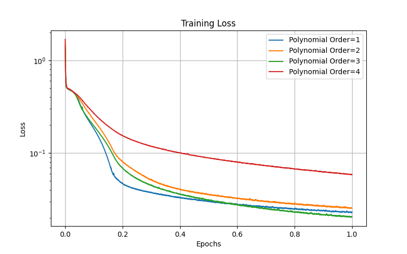
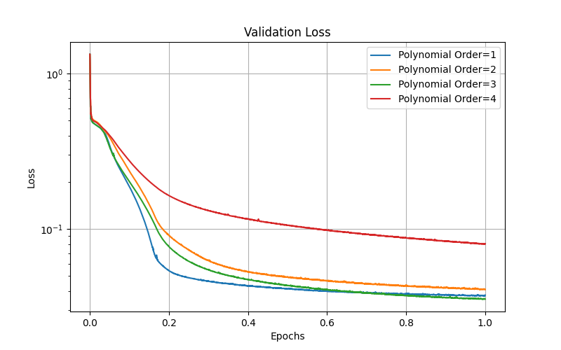
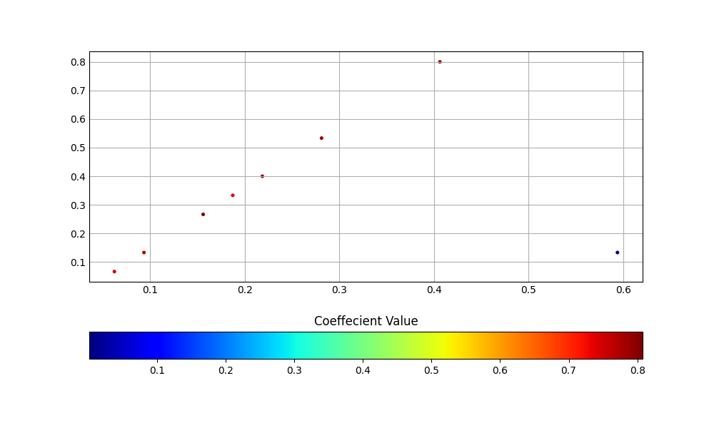
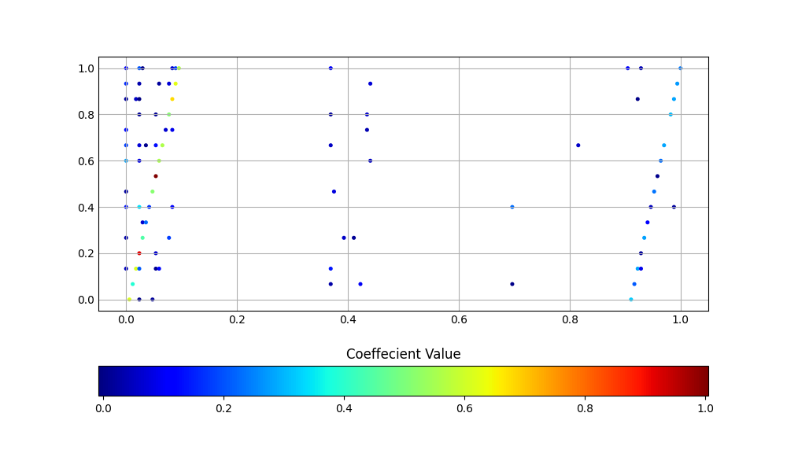
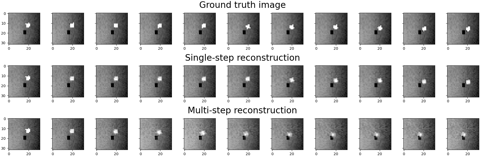

# Sparse Identification of Nonlinear Dynamical Systems (SINDy) for Planar Pushing

[](LICENSE)

This repository implements a novel approach combining autoencoders with Sparse Identification of Nonlinear Dynamics (SINDy) for learning parsimonious dynamical models in a reduced latent space. The method is applied to a planar pushing task using the Franka Panda robot arm in a PyBullet simulation environment.

## Overview

Traditional approaches to modeling high-dimensional dynamical systems often struggle with complexity and interpretability. This work addresses these challenges by:

1. **Autoencoder-based Dimensionality Reduction**: Transforming high-dimensional image observations into a low-dimensional latent space
2. **Sparse Dynamical Modeling**: Using SINDy to discover parsimonious governing equations in the latent space
3. **Model Predictive Control**: Implementing MPPI (Model Predictive Path Integral) control for trajectory optimization

The resulting models are interpretable, generalizable, and computationally efficient compared to black-box neural network approaches.

## Key Features

- **Latent Space Dynamics**: Learns dynamics in a 16-dimensional latent space from 32×32 pixel images
- **Sparse Regression**: Employs sequential thresholding to promote sparsity in SINDy coefficients
- **Multi-step Prediction**: Supports both single-step and multi-step dynamics prediction
- **MPPI Controller**: Implements Model Predictive Path Integral control in latent space
- **Comparative Analysis**: Benchmarks against linear Embed-to-Control (E2C) baseline models

## Architecture

### Model Components

1. **State Encoder**: Convolutional neural network that maps 32×32 grayscale images to 16-dimensional latent vectors
2. **SINDy Dynamics Model**: Sparse identification of nonlinear dynamics using polynomial basis functions (orders 1-4)
3. **State Decoder**: Transposes convolutional network that reconstructs images from latent vectors
4. **MPPI Controller**: Trajectory optimization using latent space dynamics

### Training Loss

The model is trained end-to-end using a multi-objective loss function:

```
L_total = L_reconstruction + L_prediction + L_regularization
```

Where:
- `L_reconstruction`: Image reconstruction loss
- `L_prediction`: Latent and state prediction losses
- `L_regularization`: L1 sparsity regularization on SINDy coefficients

## Installation

### Prerequisites

- Python 3.8+
- PyTorch 1.9+
- PyBullet
- Gymnasium
- NumPy, SciPy, Matplotlib

### Setup

1. Clone the repository:
```bash
git clone https://github.com/your-username/Sparse-Identification-of-Nonlinear-Dynamical-systems-SINDy-.git
cd Sparse-Identification-of-Nonlinear-Dynamical-systems-SINDy-
```

2. Install dependencies:
```bash
./install.sh
```

Or manually:
```bash
pip install torch torchvision numpy scipy matplotlib gymnasium pybullet tqdm numpngw
```

## Usage

### Training

Train the SINDy model with different polynomial orders:

```python
python train.py  # Trains with polynomial order 3 by default
```

Modify `POLY_ORDER` in `train.py` for different orders (1-4).

### Evaluation

Run evaluation and visualization:

```python
python demo.py
```

This will:
- Load a pre-trained model
- Evaluate on test data
- Generate reconstruction visualizations
- Run MPPI control simulation

### Data Collection

The repository includes pre-collected datasets:
- `pushing_image_data.npy`: Training trajectories
- `pushing_image_validation_data.npy`: Validation data

For collecting new data, modify the data collection functions in `learning_latent_dynamics.py`.

## Results

### Performance Metrics

| Model | Training Loss | Validation Loss | Test Loss | Steps to Goal | Sparsity % |
|-------|---------------|-----------------|-----------|---------------|------------|
| SINDy (Order 1) | 0.0232 | 0.0376 | 0.0631 | 15 | 98.3% |
| SINDy (Order 2) | 0.0255 | 0.0409 | 0.0597 | 15 | 96.3% |
| SINDy (Order 3) | 0.0206 | 0.0355 | 0.0647 | 15 | 96.0% |
| SINDy (Order 4) | 0.0587 | 0.0804 | 0.1018 | 15 | 94.6% |
| E2C (Baseline) | 0.0286 | 0.0574 | 0.2212 | 5 | N/A |

### Training Convergence




*Training and validation loss curves for different polynomial orders*

### Sparsity Analysis




*Active SINDy coefficients showing sparsity patterns. Rows represent latent dimensions, columns represent basis functions.*

### Control Performance


*MPPI control trajectories for different polynomial orders*

### Reconstruction Quality



*Original vs reconstructed images showing autoencoder performance*

## Scope and Applications

This framework is applicable to:

- **Robotics**: Manipulation tasks, locomotion, autonomous navigation
- **Scientific Discovery**: Identifying governing equations from experimental data
- **Control Systems**: Model-based control in high-dimensional state spaces
- **System Identification**: Learning dynamics from image observations

## Limitations

1. **Computational Complexity**: Higher polynomial orders increase computational cost
2. **Numerical Stability**: Higher-order models may produce NaN values in MPPI control
3. **Single-step Focus**: Current implementation optimized for single-step dynamics
4. **Environment Specificity**: Trained specifically for planar pushing task
5. **Data Requirements**: Requires sufficient trajectory data for sparse regression

## Future Improvements

1. **Multi-step Dynamics**: Extend to learn accurate multi-step prediction models
2. **Adaptive Polynomial Orders**: Dynamically select optimal polynomial complexity
3. **Robust Control**: Improve numerical stability of MPPI with higher-order models
4. **Generalization**: Apply to diverse robotic manipulation tasks
5. **Real-world Deployment**: Transfer learned models to physical robot systems
6. **Hybrid Approaches**: Combine with physics-based priors for better sample efficiency
7. **Temporal Modeling**: Incorporate temporal dependencies for long-horizon predictions

## Project Structure

```
├── assets/                 # Robot URDF files and meshes
├── documents/              # Final report and documentation
├── gifs/                   # Animation visualizations
├── plots/                  # Training curves and coefficient plots
├── demo.py                 # Evaluation and visualization script
├── install.sh              # Installation script
├── learning_latent_dynamics.py  # Core model implementations
├── LICENSE                 # MIT License
├── mppi.py                 # MPPI controller implementation
├── panda_pushing_env.py    # PyBullet environment
├── pushing_image_data.npy  # Training dataset
├── pushing_image_validation_data.npy  # Validation dataset
├── sindy_utils.py          # SINDy library functions
├── test.py                 # Testing utilities
├── train.py                # Training script
├── utils.py                # Helper functions
└── visualizers.py          # Visualization tools
```

## Citation

If you use this code in your research, please cite:

```bibtex
@misc{shrivastava2023sindy,
  title={Sparse Identification of Nonlinear Dynamical Systems for Planar Pushing},
  author={Shrivastava, Aayushi and Shiveshwar, Pratik},
  year={2023},
  publisher={GitHub},
  url={https://github.com/your-username/Sparse-Identification-of-Nonlinear-Dynamical-systems-SINDy-}
}
```

## Acknowledgments

This work builds upon the following research:

- Brunton et al. "Discovering governing equations from data by sparse identification of nonlinear dynamical systems" (PNAS, 2016)
- Champion et al. "Data-driven discovery of coordinates and governing equations" (PNAS, 2019)
- Williams et al. "Information theoretic MPC for model-based reinforcement learning" (ICRA, 2017)

## License

This project is licensed under the MIT License - see the [LICENSE](LICENSE) file for details.